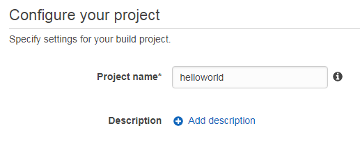
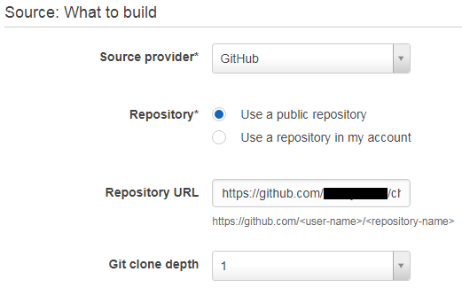
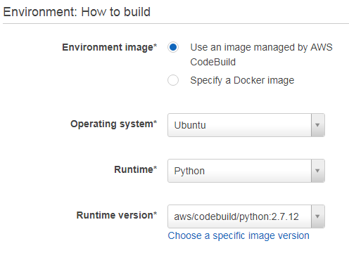
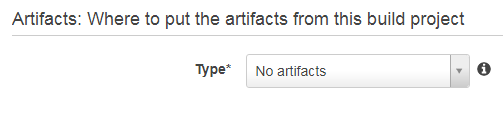

# Writing Unit Tests for Chalice

Chalice is a python serverless microframework for AWS that allows you to quickly create and deploy applications that use Amazon API Gateway and AWS Lambda. In this blog post I discuss how to create unit tests for Chalice and automate testing with CodeBuild. I will use Chalice Local Mode to execute these tests without provisioning API Gateway and Lambda resources.

## Creating a New Project

Let's begin by creating a new Chalice project using the **chalice** command line. *Note: You might want to create a [virtual environemnt](https://virtualenv.pypa.io/en/stable/) to run this tutorial.*

```
$ pip install chalice 
$ chalice new-project helloworld && cd helloworld
$ cat app.py
```

As you can see, this will create a simple application with a few sample functions. Notice that there are two functions, **hello_name** and **create_user**, that have been commented out in the sample code. Open app.py in a text editor and uncomment those lines. The complete application should look like this:

```
from chalice import Chalice

app = Chalice(app_name='chalice-unit-test')


@app.route('/')
def index():
    return {'hello': 'world'}


@app.route('/hello/{name}')
def hello_name(name):
    # '/hello/james' -> {"hello": "james"}
    return {'hello': name}


@app.route('/users', methods=['POST'])
def create_user():
    # This is the JSON body the user sent in their POST request.
    user_as_json = app.current_request.json_body
    # We'll echo the json body back to the user in a 'user' key.
    return {'user': user_as_json}
```

## Chalice Local Mode

As you develop your application, you may want to experiment locally before deploying your changes. You can use chalice local to spin up a local HTTP server like this: 

```
$ chalice local
Serving on 127.0.0.1:8000
```

Now we can test our application using curl. *Note: You will need to start a second shell.*

```
$ curl 127.0.0.1:8000
{"hello": "world"}
```

Local mode is great, but we want to automate testing to ensure all our tests run regularly. Next I'll create a python unit test to automate testing.

## Writing a Unit Test

**pytest** is a framework that makes it easy to write unit tests. If you don't already have **pytest** installed, you can install it using pip.

```
$ pip install pytest
```

I'll add a new module to my project called app_test.py with the following content.

```
import json
import unittest
from chalice.config import Config
from chalice.local import LocalGateway
from app import app


class ChaliceTestCase(unittest.TestCase):

    def setUp(self):
        self.localGateway = LocalGateway(app, Config())

    def test_index(self):
        gateway = self.localGateway
        response = gateway.handle_request(method='GET',
                                          path='/',
                                          headers={},
                                          body='')
        assert response['statusCode'] == 200
        assert json.loads(response['body']) == dict([('hello', 'world')])


if __name__ == '__main__':
    unittest.main()
```

Our module includes a new class called **ChaliceTestCase** that inherits from **TestCase**. The **startUp** function is called when the test starts. This is where we set up our environment. I programmatically create a local gateway to host our application. This is the equivalent of the **chalice local** command we ran earlier. 

Next I have a single test that submits a GET request to our application and verifies that I receive a expected response. This is the equivalent of the **curl** command that we tested earlier. You execute the unit test with the **pytest** command. 

```
$ pytest
========================= test session starts ========================
platform linux2 -- Python 2.7.12, pytest-3.4.2, py-1.5.3, pluggy-0.6.0
rootdir: /home/ec2-user/helloworld, inifile:
plugins: pep8-1.0.6, flakes-2.0.0, cov-2.5.1
collected 1 item

app_test.py .                                                    [100%]

====================== 1 passed in 0.02 seconds ======================
```

## Add Additional Tests

Let's add a few more tests to validate the other functions in our project. **test_hello** expects to receive a name of the person to say hello to in the path. Here is a test case that passes "alice" and ensures response is correct.

```
    def test_hello(self):
        gateway = self.localGateway
        response = gateway.handle_request(method='GET',
                                          path='/hello/alice',
                                          headers={},
                                          body='')
        assert response['statusCode'] == 200
        assert json.loads(response['body']) == dict([('hello', 'alice')])
```

Unlike the previous functions, **test_users** uses the POST verb rather than GET. POST requests require a body and a content-type header to tell Chalice what type of data you sending. 

```
    def test_users(self):
        gateway = self.localGateway
        response = gateway.handle_request(method='POST',
                                          path='/users',
                                          headers={'Content-Type':
                                                   'application/json'},
                                          body='["alice","bob"]')
        assert response['statusCode'] == 200
        expected = json.loads('{"user":["alice","bob"]}')
        actual = json.loads(response['body'])
        assert actual == expected
```

Now when we run pytest, our three tests run with all 3 passing.

```
$ pytest
========================= test session starts ========================
platform linux2 -- Python 2.7.12, pytest-3.4.2, py-1.5.3, pluggy-0.6.0
rootdir: /home/ec2-user/helloworld, inifile:
plugins: pep8-1.0.6, flakes-2.0.0, cov-2.5.1
collected 4 items

app_test.py ...                                                 [100%]

====================== 3 passed in 0.05 seconds ======================
```

## Automating Testing with CodeBuild

Now that we have our test cases working we can automate testing with AWS CodeBuild. AWS CodeBuild is a fully managed build service that compiles source code, runs tests, and produces software packages that are ready to deploy.

Let's begin by adding a file called buildspec.yml to our project. A build spec is a collection of build commands and related settings, in YAML format, that AWS CodeBuild uses to run a build. Open **buildspec.yml** in a text editor and add the following content.  

```
version: 0.2

phases:
  build:
    commands:
      - echo Build started on `date`
      - pip install chalice
      - pytest 
  post_build:
    commands:
      - echo Build completed on `date`

```

My **buildspec.yml** contains two commands. The first installs chalice and the second starts pytest. Now we can create a CodeBuild project. You will need to post your code someplace that CodeBuild can access it. I'm going to check my sample application into [GitHub](http://tbd). Now I can create a CodeBuild project.

1) Open the [AWS CodeBuild Console](https://console.aws.amazon.com/codebuild/home)
2) Click the **New Project** button
3) Name your project



4) Under the Source section, tell CodeBuild where to find your project. I'm using GitHub.



5) Under the Environment section, specify a Python 2.7 Runtime on Ubuntu.

 

6) Under Artifacts, set the Type to **No artifacts**

 

7) Click **Continue** and then **Save and Build** and finally **Start Build**.

After a few minutes your build should finish successfully. If it does not, you can scroll down to the Build logs section to debug it.

*NOTE: It is important to remember that your unit tests are running in local mode in a container launched by the CodeBuild service rather than deploying resources to API Gateway and Lambda. The chalice local command does not assume the role associated with your lambda function. Therefore, if your project requires access to AWS services (e.g. S3 or DynamoDB) you’ll need to assign the required permissions to the [CodeBuild Service Role](https://docs.aws.amazon.com/codebuild/latest/userguide/setting-up.html?icmpid=docs_acb_console#setting-up-service-role) so your unit tests have access to the required resources.*

## Conclusion 

Chalice allows you to quickly create and deploy serverless applications. In addition, Chalice's Local Mode allows you to easily create unit tests for your projects. Finally, AWS CodeBuild allows you automate your tests to ensure your application is tested regularly. 